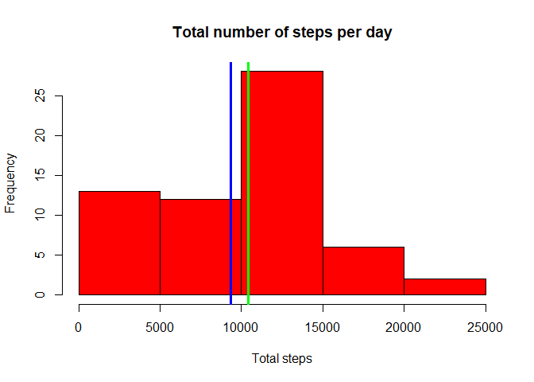
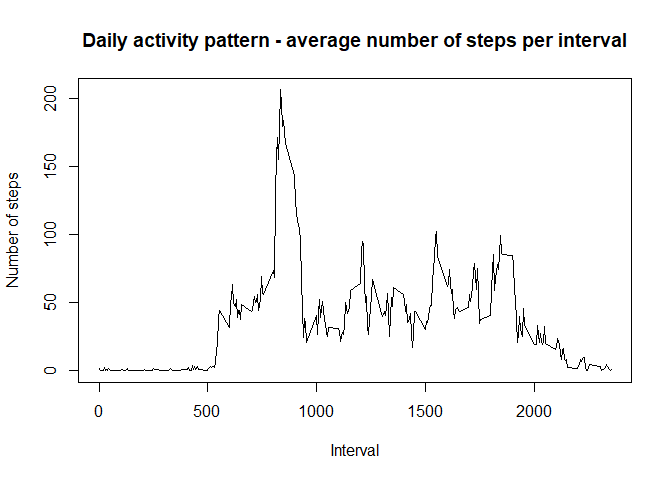
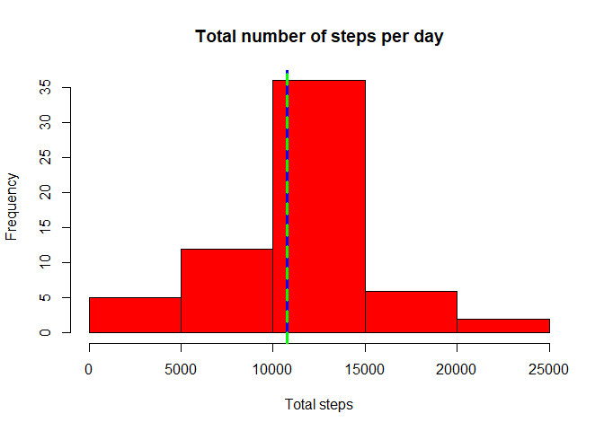
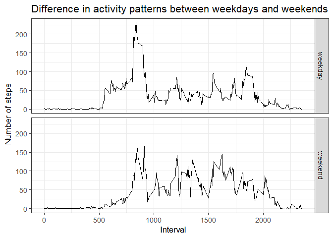

This analysis makes use of data from a personal activity monitoring device. 
This device collects data at 5 minute intervals through out the day. 
The data consists of two months of data from an anonymous individual collected 
during the months of October and November, 2012 and include the number of steps 
taken in 5 minute intervals each day.


## Loading and preprocessing the data

First, we will unzip the data zip file (if not already done) and load the .csv 
file into R as a data frame.


```r
if(!file.exists("activity.csv"))
                unzip("activity.zip")
        
        con <- file("activity.csv", "r")
        activity <- read.csv(con, header = TRUE, sep = ",",na.strings = "NA",
                             stringsAsFactors = FALSE)
        close(con)
```


Then transform it into a tibble using the "dplyr" package, which needs to be 
loaded beforehand. We also format the date column into a date format and create 
three new columns and rearrange the data frame.


```r
library(dplyr)

activity <- tbl_df(activity)

activity$date <- as.Date(activity$date, "%Y-%m-%d")
        
activity <- activity %>% 
                mutate(instant = which(interval>=0) - 1,
                       hours = floor(interval/100),
                       minutes = interval %% 100
                       ) %>%
                select(instant, interval, date, hours, minutes, steps)
```

The three new columns are **instant**, **hours** 
and **minutes**. So that the new data frame, looks like this:


```r
print(activity)
```

```
## # A tibble: 17,568 x 6
##    instant interval date       hours minutes steps
##      <dbl>    <int> <date>     <dbl>   <dbl> <int>
##  1       0        0 2012-10-01     0       0    NA
##  2       1        5 2012-10-01     0       5    NA
##  3       2       10 2012-10-01     0      10    NA
##  4       3       15 2012-10-01     0      15    NA
##  5       4       20 2012-10-01     0      20    NA
##  6       5       25 2012-10-01     0      25    NA
##  7       6       30 2012-10-01     0      30    NA
##  8       7       35 2012-10-01     0      35    NA
##  9       8       40 2012-10-01     0      40    NA
## 10       9       45 2012-10-01     0      45    NA
## # ... with 17,558 more rows
```

Now, we create a new column called **time** from the above **hours** 
and **minutes** columns, in this way (note that we are loading the 
"chron" package) to deal with character to time conversion.


```r
library(chron)
activity$hours[activity$hours < 10] <- paste(0, 
                                             activity$hours[activity$hours<10], 
                                             sep = "")
activity$minutes[activity$minutes < 10] <- paste(0, 
                                                 activity$minutes[activity$minutes<10], 
                                                 sep = "")
time <- paste(paste(activity$hours,":",activity$minutes),":","00")
activity <- activity %>% mutate(time = chron(times.=time, format = "h:m:s")) %>%
        select(instant, interval, date, time, steps)
```

So that the final data frame we are going to work with, looks like this:


```r
print(activity)
```

```
## # A tibble: 17,568 x 5
##    instant interval date       time     steps
##      <dbl>    <int> <date>     <times>  <int>
##  1       0        0 2012-10-01 00:00:00    NA
##  2       1        5 2012-10-01 00:05:00    NA
##  3       2       10 2012-10-01 00:10:00    NA
##  4       3       15 2012-10-01 00:15:00    NA
##  5       4       20 2012-10-01 00:20:00    NA
##  6       5       25 2012-10-01 00:25:00    NA
##  7       6       30 2012-10-01 00:30:00    NA
##  8       7       35 2012-10-01 00:35:00    NA
##  9       8       40 2012-10-01 00:40:00    NA
## 10       9       45 2012-10-01 00:45:00    NA
## # ... with 17,558 more rows
```


## What is mean total number of steps taken per day?

The total number of steps per day can be calculated simply using the following 
piece of code. The result is given as a data frame of two columns containing 
respectively the date and the corresponding total number of steps for each day.

```r
dailyActivity <- activity %>% group_by(date) %>%
                summarise(total_steps = sum(steps, na.rm = TRUE))
print(dailyActivity)
```

```
## # A tibble: 61 x 2
##    date       total_steps
##    <date>           <int>
##  1 2012-10-01           0
##  2 2012-10-02         126
##  3 2012-10-03       11352
##  4 2012-10-04       12116
##  5 2012-10-05       13294
##  6 2012-10-06       15420
##  7 2012-10-07       11015
##  8 2012-10-08           0
##  9 2012-10-09       12811
## 10 2012-10-10        9900
## # ... with 51 more rows
```

A summary of the second column of it is visible below giving, among others, the 
mean (**9354**) and 
median (**10395**) 
values of the second column.


```r
summary(dailyActivity$total_steps)
```

```
##    Min. 1st Qu.  Median    Mean 3rd Qu.    Max. 
##       0    6778   10395    9354   12811   21194
```


The following figure shows a histogram of the total number of steps per day, on 
which we reported the mean in blue and the median in grean


```r
with(dailyActivity, hist(total_steps, col = "red", 
                         xlab = "Total steps", 
                         main = "Total number of steps per day"
                         )
     )
abline(v = mean(dailyActivity$total_steps), col = "blue", lwd = 3)
abline(v = median(dailyActivity$total_steps), col = "green", lwd = 3)
```

<!-- -->


## What is the average daily activity pattern?

To find the average activity pattern, we need to group the data by interval and 
and take the mean of each segment. This produces a data frame of two columns, as
shown here:


```r
avgActivity <- activity %>% group_by(interval) %>%
                summarise(avg_steps = mean(steps, na.rm = TRUE))
maxInterval <- avgActivity$interval[avgActivity$avg_steps == max(avgActivity$avg_steps)]
maxTime <- c(as.character(unique(activity$time[activity$interval == maxInterval - 5])),
             as.character(unique(activity$time[activity$interval == maxInterval]))
                )
print(avgActivity)
```

```
## # A tibble: 288 x 2
##    interval avg_steps
##       <int>     <dbl>
##  1        0    1.72  
##  2        5    0.340 
##  3       10    0.132 
##  4       15    0.151 
##  5       20    0.0755
##  6       25    2.09  
##  7       30    0.528 
##  8       35    0.868 
##  9       40    0     
## 10       45    1.47  
## # ... with 278 more rows
```

The plot below shows the relationship between the average number of steps and the
corresponding interval


```r
with(avgActivity, plot(interval, avg_steps, type = "l", 
                        main = "Daily activity pattern - average number of steps per interval", 
                       xlab = "Interval", ylab = "Number of steps"
                       )
     )
```

<!-- -->

The five-minute interval that has, on average across all the days of the data set,
the maximum number of steps is **835**. Wich corresponds to the time
between **08:30:00**  and **08:35:00** in the morning. 
This makes sense, the man must go to work on foot !!


## Imputing missing values

Using the summary command on the variable steps.

```r
summary(activity$steps)
```

```
##    Min. 1st Qu.  Median    Mean 3rd Qu.    Max.    NA's 
##    0.00    0.00    0.00   37.38   12.00  806.00    2304
```

We see that the number of missing values is  **2304**.
This represents a total percentage of missing values of 
**13.1 %** of the observations.

The following piece of code fills in the missing values in the **steps** column, 
and creates a new filled-in data set **newActivity**. For each missing value, we 
impute the average number of steps of the corresponding five-minute interval. 
We make use of the last calculated data frame **avgActivity** above.


```r
newActivity <- activity
for (i in 1:length(newActivity$steps)){
        
        if(is.na(newActivity$steps[i])){
                newActivity$steps[i] <- avgActivity$avg_steps[avgActivity$interval == newActivity$interval[i]]
        }
}
print(newActivity)
```

```
## # A tibble: 17,568 x 5
##    instant interval date       time      steps
##      <dbl>    <int> <date>     <times>   <dbl>
##  1       0        0 2012-10-01 00:00:00 1.72  
##  2       1        5 2012-10-01 00:05:00 0.340 
##  3       2       10 2012-10-01 00:10:00 0.132 
##  4       3       15 2012-10-01 00:15:00 0.151 
##  5       4       20 2012-10-01 00:20:00 0.0755
##  6       5       25 2012-10-01 00:25:00 2.09  
##  7       6       30 2012-10-01 00:30:00 0.528 
##  8       7       35 2012-10-01 00:35:00 0.868 
##  9       8       40 2012-10-01 00:40:00 0     
## 10       9       45 2012-10-01 00:45:00 1.47  
## # ... with 17,558 more rows
```

The new summary of the variable **steps** of the new filled-in data set is here.
Notice that no missing values are reported and that only the 3rd percentile has 
changed from **12** to **27**.


```r
summary(newActivity$steps)
```

```
##    Min. 1st Qu.  Median    Mean 3rd Qu.    Max. 
##    0.00    0.00    0.00   37.38   27.00  806.00
```

The total number of steps per day in the new data set can be calculated again as
follows: 

```r
newDailyActivity <- newActivity %>% group_by(date) %>%
                summarise(total_steps = sum(steps, na.rm = TRUE))
print(newDailyActivity)
```

```
## # A tibble: 61 x 2
##    date       total_steps
##    <date>           <dbl>
##  1 2012-10-01      10766.
##  2 2012-10-02        126 
##  3 2012-10-03      11352 
##  4 2012-10-04      12116 
##  5 2012-10-05      13294 
##  6 2012-10-06      15420 
##  7 2012-10-07      11015 
##  8 2012-10-08      10766.
##  9 2012-10-09      12811 
## 10 2012-10-10       9900 
## # ... with 51 more rows
```

A summary of the second column of it is visible below giving, among others, the 
mean and median values values of the second column which are both equal to 
(**10766**) .


```r
summary(newDailyActivity$total_steps)
```

```
##    Min. 1st Qu.  Median    Mean 3rd Qu.    Max. 
##      41    9819   10766   10766   12811   21194
```


The following figure shows a histogram of the total number of steps per day, in 
the new data set on which we reported the mean in blue and the median in dashed grean.


```r
with(newDailyActivity, hist(total_steps, col = "red", 
                         xlab = "Total steps", 
                         main = "Total number of steps per day"
                         )
     )
abline(v = mean(newDailyActivity$total_steps), col = "blue", lwd = 3)
abline(v = median(newDailyActivity$total_steps), col = "green", lty = 2, lwd = 3)
```

<!-- -->

filling in the fissing data increased the mean and median values (which bacame equal) 
of the total number of steps per day. 


## Are there differences in activity patterns between weekdays and weekends?

The following code creates a vector variable that has two values *"weekday"* and 
*"weekend"* according to the date in the original data set.


```r
weekend <- c("samedi", "dimanche")
dayLevel <- rep("weekday", length(newActivity$date))
dayLevel[which(weekdays(newActivity$date) %in% weekend)] <- "weekend"
```

Now, we will add this variable as factor column called *day* to the filled-in data 
set and group the data by *interval* and *day*.


```r
diffActivity <- newActivity %>% mutate(day = as.factor(dayLevel)) %>% 
                group_by(interval, day) %>%
                summarise(avg_steps = mean(steps))
```

this data frame looks like this:


```r
print(diffActivity)
```

```
## # A tibble: 576 x 3
## # Groups:   interval [288]
##    interval day     avg_steps
##       <int> <fct>       <dbl>
##  1        0 weekday   2.25   
##  2        0 weekend   0.215  
##  3        5 weekday   0.445  
##  4        5 weekend   0.0425 
##  5       10 weekday   0.173  
##  6       10 weekend   0.0165 
##  7       15 weekday   0.198  
##  8       15 weekend   0.0189 
##  9       20 weekday   0.0990 
## 10       20 weekend   0.00943
## # ... with 566 more rows
```

All that is left now is to plot the number of steps as a function of the interval 
for both the weekends and the weekdays. For this we can use *ggplot* as follows:


```r
library(ggplot2)

g <- ggplot(diffActivity, aes(interval, avg_steps))
g <- g + geom_line(stat = "identity") + facet_grid(day~.)
g <- g + theme_bw(base_size = 13)
g <- g + labs(x = "Interval", y = expression("Number of steps"))
g <- g + labs(title = "Difference in activity patterns between weekdays and weekends")

print(g)
```

<!-- -->

We notice that, during weekdays, most activity happens in the morning where the 
maximum number steps is clearly visible. On the other hand, during weekends, 
activity is less pronounced in the morning but during the rest of the day, it is 
on average more than during the weekdays.
